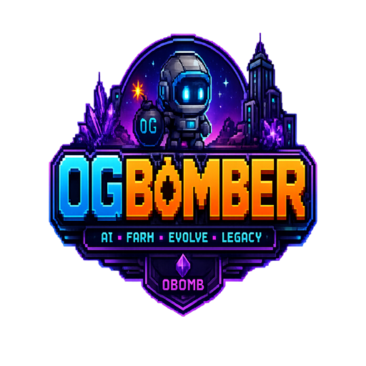

<div align="center">
  
  <h1>0GBomber Architecture</h1>
  <p><strong>AI-Powered Autonomous Farming Game on 0G</strong></p>
</div>

---

## Overview

0GBomber uses a **layered architecture** separating the frontend, game engine, AI engine, blockchain layer, and persistence layer. Each layer is independently testable and replaceable.

```
┌─────────────────────────────────────────────────────────────────────────────┐
│                           PRESENTATION LAYER                                │
│  ┌────────────────┐  ┌────────────────┐  ┌──────────────────────────────┐  │
│  │ Landing Page   │  │  Game Page     │  │  Admin Dashboard             │  │
│  │ - Hero Section │  │  - Battle UI   │  │  - Economy Controls          │  │
│  │ - Features     │  │  - Hero Panel  │  │  - Hero Manager              │  │
│  │ - Roadmap      │  │  - Map View    │  │  - Event Manager             │  │
│  │ - Token Section│  │  - Loot Feed   │  │  - Maintenance Mode          │  │
│  └────────────────┘  └────────────────┘  └──────────────────────────────┘  │
│  ┌────────────────┐  ┌────────────────┐  ┌──────────────────────────────┐  │
│  │ Hero Detail    │  │  Marketplace   │  │  Wallet Components           │  │
│  │ - 11 Tabs      │  │  - Listings    │  │  - Connect Button            │  │
│  │ - Stats        │  │  - Buy/Sell    │  │  - Balance Display           │  │
│  │ - Equipment    │  │  - History     │  │  - Network Status             │  │
│  └────────────────┘  └────────────────┘  └──────────────────────────────┘  │
├─────────────────────────────────────────────────────────────────────────────┤
│                           GAME ENGINE LAYER                                 │
│  ┌──────────────────────────────────────────────────────────────────────┐  │
│  │                     Game State Manager                                │  │
│  │  ┌──────────┐ ┌──────────┐ ┌──────────┐ ┌──────────┐ ┌──────────┐  │  │
│  │  │ Hero     │ │Equipment │ │Cosmetic  │ │  Trait   │ │  Legacy  │  │  │
│  │  │ CRUD     │ │ System   │ │ System   │ │ System   │ │ System   │  │  │
│  │  └──────────┘ └──────────┘ └──────────┘ └──────────┘ └──────────┘  │  │
│  │  ┌──────────┐ ┌──────────┐ ┌──────────┐ ┌──────────────────────┐  │  │
│  │  │ Auto     │ │ Energy   │ │  XP &    │ │  Marketplace         │  │  │
│  │  │ Farm     │ │ System   │ │ Level    │ │  Engine              │  │  │
│  │  └──────────┘ └──────────┘ └──────────┘ └──────────────────────┘  │  │
│  └──────────────────────────────────────────────────────────────────────┘  │
├─────────────────────────────────────────────────────────────────────────────┤
│                           AI ENGINE LAYER                                   │
│  ┌──────────────────────────────────────────────────────────────────────┐  │
│  │                     AI Decision Engine                                │  │
│  │                                                                      │  │
│  │  ┌──────────────┐    ┌──────────────┐    ┌──────────────────────┐  │  │
│  │  │ Action       │    │  Stuck       │    │  Team AI             │  │  │
│  │  │ Scoring      │    │  Detection   │    │  (Loyalty-based)     │  │  │
│  │  └──────────────┘    └──────────────┘    └──────────────────────┘  │  │
│  │  ┌──────────────┐    ┌──────────────┐    ┌──────────────────────┐  │  │
│  │  │ Threat/Opp   │    │  Memory      │    │  Difficulty          │  │  │
│  │  │ Scanning     │    │  Influence   │    │  Scaling             │  │  │
│  │  └──────────────┘    └──────────────┘    └──────────────────────┘  │  │
│  └──────────────────────────────────────────────────────────────────────┘  │
├─────────────────────────────────────────────────────────────────────────────┤
│                           BLOCKCHAIN LAYER                                  │
│  ┌──────────────────────────────────────────────────────────────────────┐  │
│  │  ┌────────────────┐   ┌────────────────┐   ┌────────────────────┐   │  │
│  │  │ Wallet         │   │  Smart         │   │   Token/Economy    │   │  │
│  │  │ Connection     │   │  Contract      │   │   Engine           │   │  │
│  │  │ (Ethers.js)    │   │  (Solidity)    │   │   (0BOMB/SPROUT)   │   │  │
│  │  └────────────────┘   └────────────────┘   └────────────────────┘   │  │
│  └──────────────────────────────────────────────────────────────────────┘  │
├─────────────────────────────────────────────────────────────────────────────┤
│                         PERSISTENCE LAYER                                   │
│  ┌──────────────────────────────────────────────────────────────────────┐  │
│  │  ┌────────────────────┐    ┌────────────────────┐                   │  │
│  │  │   Supabase         │    │   LocalStorage     │                   │  │
│  │  │   (Marketplace,    │    │   (Game state,     │                   │  │
│  │  │    Remote data)    │    │    Settings)        │                   │  │
│  │  └────────────────────┘    └────────────────────┘                   │  │
│  └──────────────────────────────────────────────────────────────────────┘  │
└─────────────────────────────────────────────────────────────────────────────┘
```

---

## Data Flow

### Battle Lifecycle

```
┌──────────┐     ┌──────────────┐     ┌──────────────┐     ┌──────────────┐
│  Player  │     │   Frontend   │     │ Game Engine  │     │   Storage    │
└────┬─────┘     └──────┬───────┘     └──────┬───────┘     └──────┬───────┘
     │                  │                     │                    │
     │  Select Heroes   │                     │                    │
     │  & Difficulty    │                     │                    │
     │─────────────────>│                     │                    │
     │                  │  consumeDeploy      │                    │
     │                  │  Energy()           │                    │
     │                  │────────────────────>│                    │
     │                  │                     │───────────────────>│
     │                  │                     │                    │
     │                  │  createGameState()  │                    │
     │                  │────────────────────>│                    │
     │                  │                     │                    │
     │                  │  tickGame() loop    │                    │
     │                  │  (350ms intervals)  │                    │
     │                  │<────────────────────│                    │
     │                  │                     │                    │
     │  Battle UI       │                     │                    │
     │  Updates         │                     │                    │
     │<─────────────────│                     │                    │
     │                  │                     │                    │
     │                  │  Battle Ends        │                    │
     │                  │  getGameResult()    │                    │
     │                  │────────────────────>│                    │
     │                  │                     │                    │
     │                  │  generateReward     │                    │
     │                  │  Chest()            │                    │
     │                  │────────────────────>│                    │
     │                  │                     │                    │
     │  Claim Rewards   │                     │                    │
     │─────────────────>│  claimRewardChest() │                    │
     │                  │────────────────────>│                    │
     │                  │                     │                    │
     │                  │  addMemory()        │                    │
     │                  │  addXP()            │                    │
     │                  │  evolveAIStats()    │                    │
     │                  │  checkTraits()      │                    │
     │                  │────────────────────>│───────────────────>│
     │                  │                     │                    │
```

### Hero Generation Flow

```
┌──────────────┐     ┌──────────────┐     ┌──────────────────┐
│  Constants   │     │    Hero      │     │   Game State     │
│  & Config    │     │  Generator   │     │    Manager       │
└──────┬───────┘     └──────┬───────┘     └────────┬─────────┘
       │                    │                       │
       │ CLASS_CONFIG       │                       │
       │ RARITY_CONFIG ────>│                       │
       │ STAT ARRAYS        │                       │
       │                    │                       │
       │                    │  generateHero()       │
       │                    │  - roll rarity        │
       │                    │  - allocate stats     │
       │                    │  - set personality    │
       │                    │  - assign name        │
       │                    │                       │
       │                    │  Hero object ────────>│  addHero()
       │                    │                       │
       │                    │  OR if DNA source:    │
       │                    │  inheritStats()       │
       │                    │  inheritTraits()      │
       │                    │  inheritGenetics()   │
       │                    │──────────────────────>│  save to LS
```

### AI Decision Flow (Per Tick)

```
┌─────────────────────────────────────────────────────────────────┐
│                      tickGame()                                  │
│                                                                  │
│  1. Energy Drain (every 10 ticks)                               │
│  2. For each alive hero:                                        │
│     ├─ Check cooldowns (bomb, move)                             │
│     ├─ Speed factor adjustment                                  │
│     ├─ Stuck detection (position history analysis)              │
│     ├─ scanThreats() → nearby enemies, bombs, lava              │
│     ├─ scanOpportunities() → bombable targets, loot, walls      │
│     └─ scoreAction() for each possible action:                  │
│          ├─ bomb        Base: 50                                 │
│          ├─ collect_loot Base: 40                                │
│          ├─ explore     Base: 30 + (100-int)*0.1                │
│          ├─ evade       Base: 20                                 │
│          ├─ avoid_lava  Base: 10                                 │
│          ├─ idle        Base: 5                                  │
│          └─ wander      Base: 20                                 │
│                                                                  │
│     Score modifications per action:                              │
│     ├─ Intelligence modifier                                    │
│     ├─ Personality modifier (brave, greedy, curious, etc.)      │
│     ├─ Trait modifier                                           │
│     ├─ Memory modifier                                          │
│     ├─ Team modifier (loyalty-based grouping)                    │
│     ├─ Threat/Opportunity modifier                               │
│     └─ Random noise (±5%)                                       │
│                                                                  │
│     executeAction() → place bomb, move, collect, etc.            │
│                                                                  │
│  3. Enemy movement (random walk, defense-reduced damage)        │
│  4. Bomb updates (fuse countdown, explosion)                    │
└─────────────────────────────────────────────────────────────────┘
```

---

## Module Dependency Map

```
constants.ts  ←──  types.ts
      │
      ├──→ heroGenerator.ts  ──→  GameStateManager.ts
      │                              │
      ├──→ AIDecisionEngine.ts ──────┤
      │                              │
      │                       ┌──────┴──────┐
      │                       │  Frontend   │
      │                       │  Pages      │
      │                       └─────────────┘
      │
      ├──→ equipmentSystem.ts
      │
      ├──→ cosmeticSystem.ts
      │
      └──→ dropRates.ts
```

---

## Directory Structure

```
src/
├── app/                          # Next.js App Router pages
│   ├── page.tsx                  # Landing page
│   ├── game/page.tsx             # Game battle page
│   ├── heroes/page.tsx           # Hero management page
│   ├── marketplace/page.tsx      # Marketplace page
│   └── admin/page.tsx            # Admin dashboard
│
├── components/
│   ├── pixel-art/                # Pixel art sprite components
│   │   └── characters/           # Hero class sprites
│   └── wallet/                   # Wallet connection UI
│
├── hooks/                        # React hooks
│
└── lib/
    ├── game/                     # Core game engine
    │   ├── types.ts              # TypeScript interfaces
    │   ├── constants.ts          # Game configuration
    │   ├── heroGenerator.ts      # Hero generation system
    │   ├── AIDecisionEngine.ts   # AI behavior system
    │   ├── GameStateManager.ts   # State persistence & management
    │   ├── equipmentSystem.ts    # Equipment generation
    │   ├── cosmeticSystem.ts     # Cosmetic generation
    │   └── dropRates.ts          # Loot table configuration
    │
    ├── blockchain/               # Blockchain integration
    │   └── provider.ts           # Ethers.js provider & contract interaction
    │
    ├── supabase/                 # Supabase client
    │   ├── client.ts             # Lazy-initialized client
    │   └── marketplace.ts        # Remote marketplace queries
    │
    └── audio/                    # Audio manager
        └── audioManager.ts       # Sound effects & music
```

---

## Key Design Decisions

### 1. Autonomous AI Agents
Heroes are not directly controllable. The player is a **commander** who selects heroes and difficulty — the hero's AI makes all tactical decisions based on its personality, memories, and stats.

### 2. Action Score System
Instead of a rigid behavior tree, every tick each hero scores 7 possible actions using a weighted formula. The highest-scoring action wins. This creates emergent, non-deterministic behavior.

### 3. Lazy Persistence
- `GameStateManager` uses `localStorage` for offline-capable game state
- `Supabase` client is lazy-initialized (avoids SSR/prerender crashes)
- Remote sync for marketplace listings only

### 4. Memory-Driven Evolution
Heroes don't just gain XP — they build memories of specific events (kills, loot, near-death escapes). These memories influence future AI decisions and trait unlocks.

### 5. Difficulty Scaling
Three difficulty levels (Easy, Advanced, Nightmare) affect enemy count, HP, map layout, rewards, XP multipliers, and energy costs — creating a risk-reward loop.

---

<p align="center">
  <a href="./README.md">← Back to README</a> &nbsp;|&nbsp;
  <a href="./GAME_DESIGN.md">Game Design →</a>
</p>
