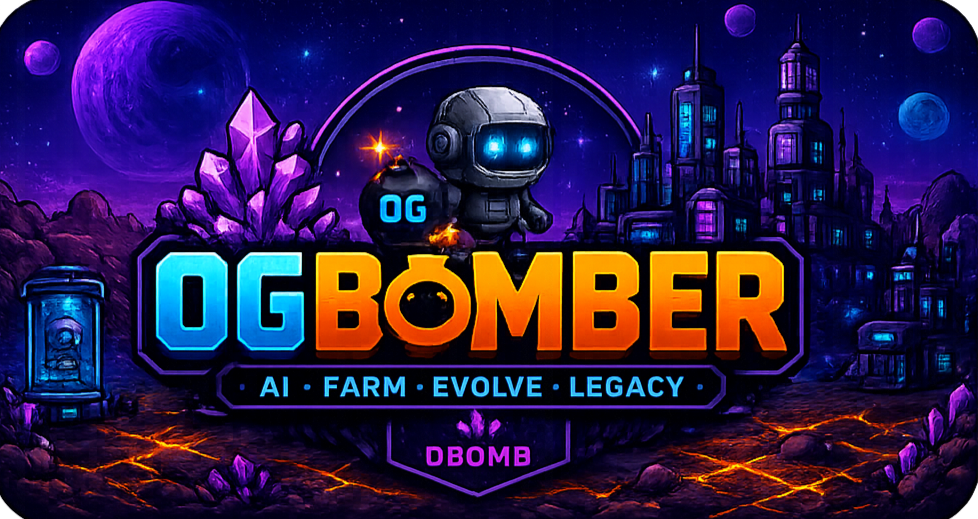

<div align="center">
  
  <br/>
  
</div>

<h1 align="center">0GBomber</h1>
<p align="center">
  <strong>AI-Powered Autonomous Farming Game on 0G</strong>
</p>

<p align="center">
  <a href="https://nextjs.org/">
    
  </a>
  <a href="https://www.typescriptlang.org/">
    
  </a>
  <a href="https://tailwindcss.com/">
    
  </a>
  <a href="https://soliditylang.org/">
    
  </a>
  <a href="https://0g.ai/">
    
  </a>
  <a href="./LICENSE">
    
  </a>
</p>

---

## What is 0GBomber?

0GBomber is an **AI-native autonomous farming game** inspired by Bomb Crypto, built on the 0G blockchain.

Players hatch AI-powered heroes, deploy them into dangerous alien environments, and watch them **learn, evolve, build bloodlines, and earn rewards** — completely autonomously.

Unlike traditional idle games, every hero is an autonomous AI agent with:

| System | Description |
|---|---|
| **DNA** | Unique genetic code passed through generations |
| **Personality** | Brave, greedy, curious, loyal, lazy, tactical — each hero is unique |
| **Memory** | Heroes remember their battles, loot finds, and near-death escapes |
| **Traits** | Unlockable bonuses like Loot Goblin, Bomb Master, Fast Learner |
| **Intelligence** | Core, AI, and farming stats that evolve through combat |
| **Legacy** | Retire a hero to create a Legacy Core for the next generation |
| **Bloodline** | Genetic inheritance system — children inherit stats and traits from parents |

---

## Features

<div align="center">
  <table>
    <tr>
      <td align="center"><strong>🤖 AI Heroes</strong><br/>Autonomous agents with unique DNA and personality</td>
      <td align="center"><strong>🧠 Memory System</strong><br/>Heroes remember battles, loot, and near-death experiences</td>
      <td align="center"><strong>🧬 Hero DNA</strong><br/>Genetic code that evolves across generations</td>
    </tr>
    <tr>
      <td align="center"><strong>🎭 Personality System</strong><br/>6 trait dimensions define every hero's behavior</td>
      <td align="center"><strong>⭐ Trait Evolution</strong><br/>Unlock special traits through combat achievements</td>
      <td align="center"><strong>👑 Legacy System</strong><br/>Retire heroes to pass power to the next generation</td>
    </tr>
    <tr>
      <td align="center"><strong>🔗 Bloodlines</strong><br/>Genetic inheritance with mutation mechanics</td>
      <td align="center"><strong>⚔️ Equipment System</strong><br/>6 equipment slots with affixes and set bonuses</td>
      <td align="center"><strong>🏪 Marketplace</strong><br/>Trade heroes, equipment, cosmetics, and items</td>
    </tr>
    <tr>
      <td align="center"><strong>🌾 Autonomous Farming</strong><br/>Auto-deploy, auto-redeploy, energy management</td>
      <td align="center"><strong>💰 Onchain Economy</strong><br/>$0BOMB token on 0G testnet with fragment conversion</td>
      <td align="center"><strong>🛠️ Admin Dashboard</strong><br/>Full economy controls, events, and maintenance mode</td>
    </tr>
  </table>
</div>

---

## Gameplay Loop

```
┌─────────────────────────────────────────────────────────┐
│                                                         │
│   🥚 Hatch Hero                                         │
│     ↓                                                   │
│   🚀 Deploy Hero                                         │
│     ↓                                                   │
│   🤖 Hero Farms Automatically                            │
│     ↓                                                   │
│   🧠 Hero Learns & Gains Memories                        │
│     ↓                                                   │
│   ⭐ Hero Evolves & Unlocks Traits                       │
│     ↓                                                   │
│   💰 Hero Earns Rewards                                  │
│     ↓                                                   │
│   👑 Hero Creates Legacy Core                            │
│     ↓                                                   │
│   🔗 Hero Builds Bloodline                                │
│     ↓                                                   │
│   🥚 Hatch Next Generation Hero                          │
│                                                         │
└─────────────────────────────────────────────────────────┘
```

---

## Tech Stack

| Category | Technology |
|---|---|
| **Frontend** | Next.js 16, React 19, TypeScript 5, Tailwind CSS 4 |
| **Blockchain** | Solidity, Ethers.js 6, 0G Galileo Testnet (Chain ID 16602) |
| **Game Engine** | AI Behavior Engine, Memory Engine, Hero DNA System, Autonomous Farming Engine |
| **Storage** | Supabase, LocalStorage |
| **Assets** | Phaser 3, Custom Pixel Art Sprites |

---

## Smart Contract

| Property | Value |
|---|---|
| **Network** | 0G Galileo Testnet |
| **Chain ID** | 16602 |
| **RPC URL** | `https://evmrpc-testnet.0g.ai` |
| **Token** | 0BOMB (`$0BOMB`) |
| **Token Decimals** | 18 |
| **Contract Address** | `0xB9Ca501a3e59716F328552C7BA26d1fa68Dc76E6` |
| **Treasury** | `0xa8DAb875Eb73173C8C96215445263AA6a6851Af6` |

---

## Getting Started

### Prerequisites

- Node.js 18+
- npm 9+
- A wallet with 0G Galileo testnet configured

### Installation

```bash
# Clone the repository
git clone https://github.com/ajoikafeb/0Bomb.git
cd 0Bomb

# Install dependencies
npm install

# Set up environment variables
cp .env.example .env.local
# Edit .env.local with your Supabase credentials

# Start development server
npm run dev
```

Open [http://localhost:3000](http://localhost:3000) to start playing.

### Build

```bash
npm run build
npm start
```

---

## Screenshots

<div align="center">
  <table>
    <tr>
      <td></td>
      <td></td>
    </tr>
    <tr>
      <td align="center"><em>Landing Page</em></td>
      <td align="center"><em>Hero Dashboard</em></td>
    </tr>
    <tr>
      <td></td>
      <td></td>
    </tr>
    <tr>
      <td align="center"><em>Autonomous Map Farming</em></td>
      <td align="center"><em>Marketplace</em></td>
    </tr>
    <tr>
      <td colspan="2"></td>
    </tr>
    <tr>
      <td align="center" colspan="2"><em>Admin Dashboard</em></td>
    </tr>
  </table>
</div>

---

## Core Game Systems

| System | Documentation |
|---|---|
| Hero System | [GAME_DESIGN.md](./GAME_DESIGN.md#hero-system) |
| AI System | [GAME_DESIGN.md](./GAME_DESIGN.md#ai-decision-engine) |
| Map System | [GAME_DESIGN.md](./GAME_DESIGN.md#map-system) |
| Auto Farm System | [GAME_DESIGN.md](./GAME_DESIGN.md#auto-farm-system) |
| Equipment System | [GAME_DESIGN.md](./GAME_DESIGN.md#equipment-system) |
| Legacy System | [GAME_DESIGN.md](./GAME_DESIGN.md#legacy-system) |
| Bloodline System | [GAME_DESIGN.md](./GAME_DESIGN.md#bloodline-system) |
| Economy System | [TOKENOMICS.md](./TOKENOMICS.md) |
| Marketplace | [GAME_DESIGN.md](./GAME_DESIGN.md#marketplace) |

---

## Architecture

```
┌─────────────────────────────────────────────────────────┐
│                    Frontend (Next.js)                    │
│  ┌──────────┐ ┌──────────┐ ┌──────────────────────────┐ │
│  │ Landing  │ │  Game    │ │  Admin Dashboard         │ │
│  │  Page    │ │  Page    │ │  (Economy, Events, etc)  │ │
│  └──────────┘ └──────────┘ └──────────────────────────┘ │
├─────────────────────────────────────────────────────────┤
│                    Game Engine                            │
│  ┌──────────────┐ ┌──────────────┐ ┌──────────────────┐ │
│  │  Hero        │ │  AI Decision │ │  Game State      │ │
│  │  Generator   │ │  Engine      │ │  Manager         │ │
│  └──────────────┘ └──────────────┘ └──────────────────┘ │
├─────────────────────────────────────────────────────────┤
│                   Blockchain Layer                        │
│  ┌──────────────┐ ┌──────────────┐ ┌──────────────────┐ │
│  │  Wallet      │ │  Smart       │ │  Token/Economy   │ │
│  │  Connection  │ │  Contract    │ │  Engine          │ │
│  └──────────────┘ └──────────────┘ └──────────────────┘ │
└─────────────────────────────────────────────────────────┘
```

See [ARCHITECTURE.md](./ARCHITECTURE.md) for detailed architecture diagrams.

---

## Roadmap

| Phase | Focus | Status |
|---|---|---|
| **Phase 1** | Core Gameplay — Hatching, deploying, basic AI | ✅ Complete |
| **Phase 2** | AI Evolution — Memory, traits, personality-driven behavior | ✅ Complete |
| **Phase 3** | Marketplace — Trading, fees, listings | 🔄 In Progress |
| **Phase 4** | Legacy System — Retirement, Legacy Cores | 📋 Planned |
| **Phase 5** | Bloodline System — Genetics, inheritance, mutation | 📋 Planned |
| **Phase 6** | Onchain Integration — Full $0BOMB economy, NFT verification | 📋 Planned |

See [ROADMAP.md](./ROADMAP.md) for the full roadmap.

---

## Contributing

We welcome contributions! Please see [CONTRIBUTING.md](./CONTRIBUTING.md) for guidelines.

### Quick Start

1. Fork the repository
2. Create a feature branch: `git checkout -b feature/your-feature develop`
3. Commit using conventional commits
4. Push and open a PR against `develop`

---

## License

This project is licensed under the MIT License — see the [LICENSE](./LICENSE) file for details.

---

<p align="center">
  Built on <a href="https://0g.ai/">0G</a> • Powered by AI • Autonomous by Design
</p>
